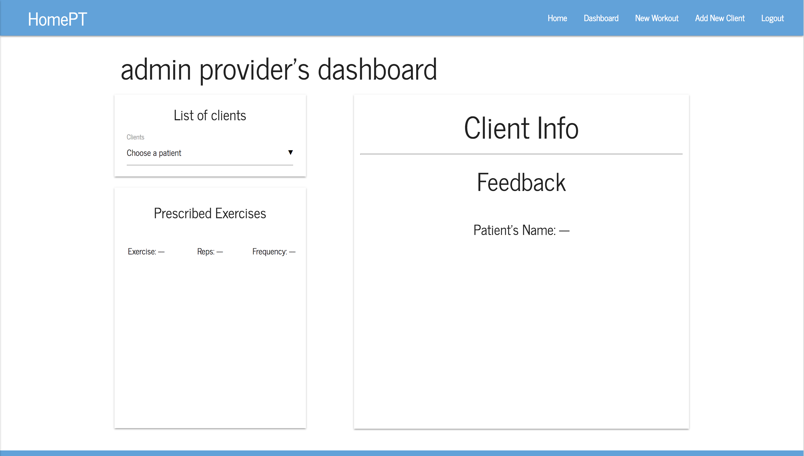
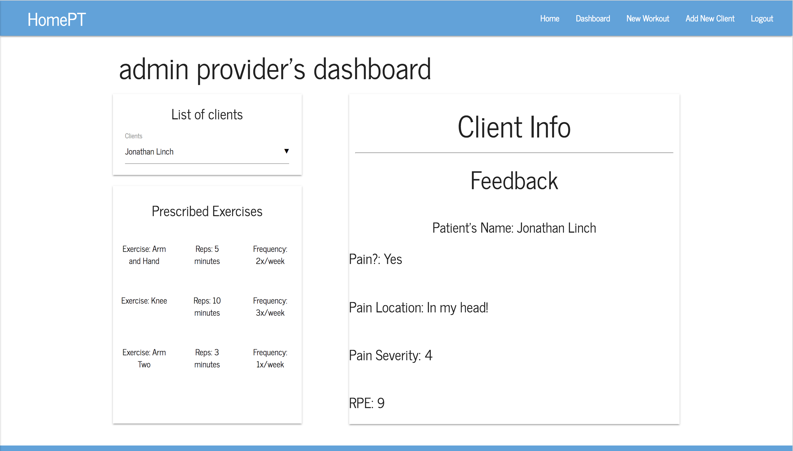
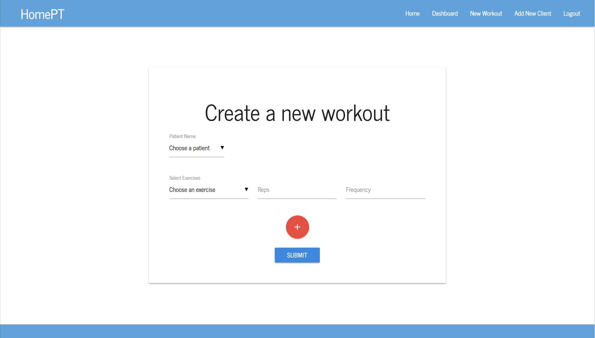
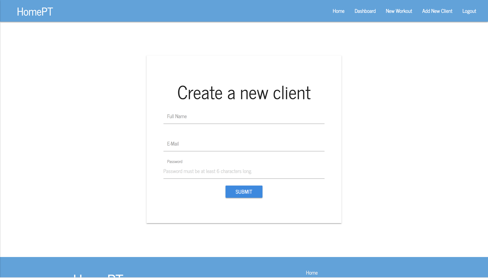
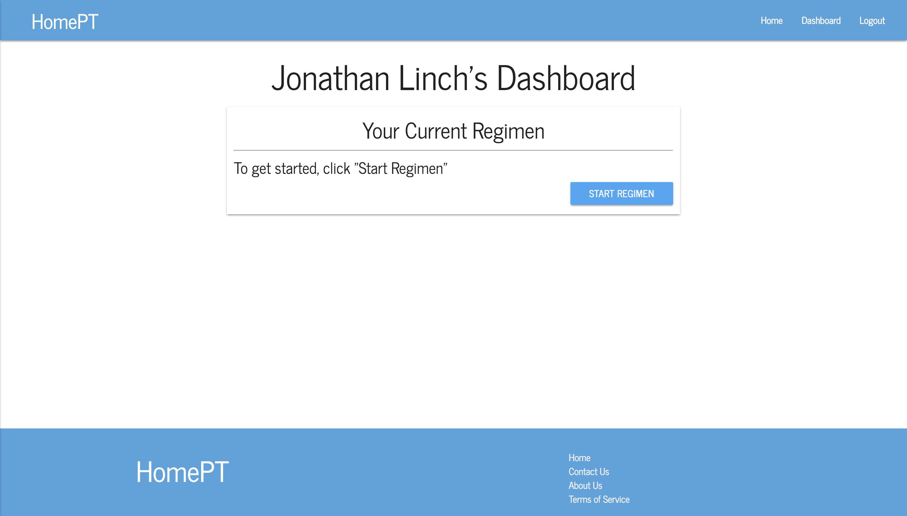
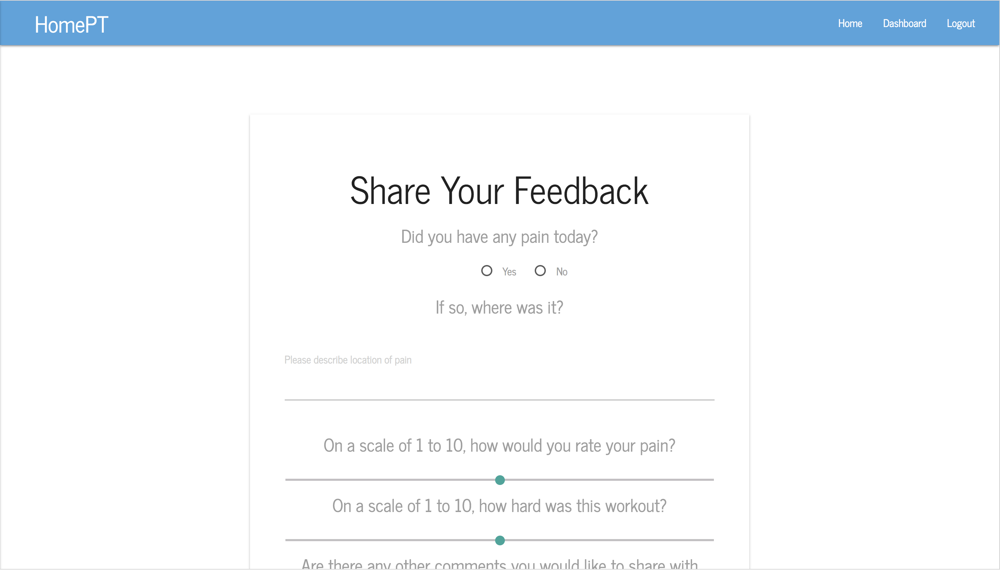

# HomePT - A web app allowing physical therapists to talk with patients

Physical therapy can be a stressful venture. It can be uncomfortable for patients who are asked to complete exercises they are unfamiliar with and it can be frustrating for physcial therapists trying to motivate patients to push past their road blocks.

In talking with both physical therapists and patients, it became clear that having a tool to quickly communicate exercise techniques and collect patient feedback could be an invaluable tool to help bridge the time between patient visits.

HomePT is a web-based app allowing physical therapists to "prescribe" workout routines to their patients who can then access their prescibed workout along with accompanying videos showing proper technique. After completing a workout, patients then have the ability to share feedback about how they felt with their physical therapist.

## Further Documentation

This README covers basic usage of the site. For more information, please
refer to our [Wiki](https://github.com/AFresnedo/frontend-pt/wiki).

## Steps to use

#### 1. Visit the site (https://homept.herokuapp.com/) and you'll be directed to the homepage.

#### 2. If you've never visited, click "Sign Up" to create an account. (Note: Only providers can create an account for their patients)

#### 3. If you have visited, click "Login" sign into your account.

#### 4. After logging in or signing up as a provider, you will be directed to the provider dashboard page.

#### 5. While on provider dashboard, you can view patient feedback and "prescribed" exercises.

 
#### 6. You can also assign a workout to a patient or create a new patient.

#### 7. If you are a patient, you will have access to your workout program along with accompanying videos.

#### 8. After a workout, patients have the ability to share feedback about the workout went.

## Next Steps

As time permits, I'd like to add functionality that would allow for better data collection and visualisation, more specific feedback about pain, motivational staements, and ability to find necessary equipment.

## Making Changes
Suggestions are always welcome. Feel free to send pull requests if you feel motivated to do so.
